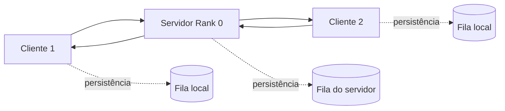

# MPI Persistent Message Broker

Projeto de Sistemas Distribuídos que simula troca de mensagens entre processos MPI com persistência em disco.

O sistema segue o modelo store-and-forward: cada processo mantém uma fila JSON local, as mensagens passam por um servidor central e continuam disponíveis mesmo quando algum processo dorme ou fica fora do ar por um tempo.

## Visão geral

O projeto foi pensado para demonstrar comunicação distribuída com:

- processos MPI em vez de threads;
- envio não-bloqueante com `isend`;
- recepção por sondagem com `iprobe`;
- persistência em arquivos JSON;
- confirmação por ACK para evitar perda de mensagens.

Em termos simples, o rank `0` atua como broker, enquanto os outros ranks funcionam como clientes que enviam e recebem mensagens através dele.

## Como funciona

1. Um cliente cria uma mensagem e salva a cópia na sua `outbox`.
2. A mensagem é enviada ao servidor com `isend`.
3. O servidor persiste a mensagem em sua própria fila e a encaminha ao destino final.
4. O cliente de origem recebe um ACK e remove a mensagem apenas da `outbox`.
5. O destino recebe a mensagem e salva na sua `inbox`.
6. A `inbox` de recebimento não é apagada pelo ACK; ela funciona como histórico local das mensagens recebidas.
7. Quando o ACK final chega ao servidor, a mensagem é removida da fila persistente dele.

O comportamento foi desenhado para tolerar atrasos aleatórios, porque cada processo dorme por intervalos variáveis durante a execução.

## Estrutura da pasta `code/`

- `main.py` - ponto de entrada da simulação principal; define o servidor e os clientes Alice e Bob.
- `server.py` - implementa o broker central do rank `0`.
- `client.py` - implementa o cliente de chat com `inbox`, `outbox`, envio e recepção.
- `persistent_queue.py` - fila persistente baseada em JSON.
- `inbox_<nome>.json`, `outbox_<nome>.json`, `queue_server.json` - arquivos de persistência usados durante a execução.

## Requisitos

- Python 3
- `mpi4py`
- uma instalação de MPI funcional, como MPICH, Open MPI ou MS MPI no Windows

Para rodar o projeto, é recomendado utilizar o `venv`.

## Como executar

Execute a simulação a partir da pasta `code/`:

```bash
mpiexec -n 3 python main.py
```

Se quiser alterar o número de iterações, o padrão é 30:

```bash
mpiexec -n 3 python main.py 50
```

O número `3` representa os três processos do demo. Ele só funciona com 3 processos:

- rank `0`: servidor
- rank `1`: Alice
- rank `2`: Bob

## Persistência

Cada processo usa um arquivo JSON próprio para registrar mensagens.

- a `outbox` guarda o que foi enviado até chegar o ACK;
- a `inbox` guarda o que foi recebido e não é apagada pelo ACK;
- o servidor guarda as mensagens em trânsito;
- os ACKs removem apenas as mensagens da fila de envio.

Isso facilita testar falhas, atrasos e recuperação após reinício.

## Arquitetura



## Objetivo didático

O projeto serve para estudar:

- passagem de mensagens com MPI;
- concorrência por processos;
- roteamento centralizado;
- tolerância a falhas com persistência local;
- estratégia de ACK e deduplicação.

## Observações

- O comportamento é propositalmente simples para fins acadêmicos.
- O uso de sleeps aleatórios ajuda a simular latência e indisponibilidade.
- Como a persistência é baseada em JSON, o projeto favorece clareza e facilidade de teste em vez de alta performance.
